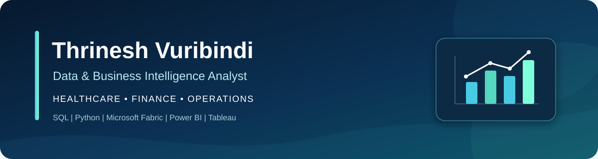

  

  
  
  

## From Raw Data to Trusted Analytics

I build the data foundation behind reliable decisions: profile and validate the source, resolve quality issues, transform it into analysis-ready models, and deliver clear BI and analysis.

My focus is **healthcare, finance, and operations**, where data quality, consistent definitions, lineage, privacy, and access matter as much as the final dashboard.

<strong>St. Louis, Missouri · Open to relocation · Available for onsite, hybrid, or remote roles across the United States</strong>

---

## Featured Projects

### [Operating Room Scheduling Reliability & Cost Exposure](https://github.com/thrinesh13/OR-Scheduling-Reliability-Analytics)

`Healthcare` `Operations` `Microsoft Fabric` `Power BI`

Built an end-to-end medallion analytics solution from **1.9M+ perioperative records**, producing a curated model of **48,118 surgical cases across 418 procedures**. The analysis found a **54.1-minute average absolute difference** from historical procedure-duration benchmarks and estimated **$15.8M–$27.1M in annual gross cost exposure** under two planning scenarios.

**Highlights:** 1.9M+ records · 48,118 cases · 418 procedures · 54.1-minute average absolute difference

[View project →](https://github.com/thrinesh13/OR-Scheduling-Reliability-Analytics)

### [Medicare Claims Processing Analytics](https://github.com/thrinesh13/Medicare-Claims-Processing-Analytics)

`Healthcare` `Finance` `Decision Analytics`

Compared manual review, rules-based processing, and checks-plus-score policies on **6,627 evaluation-period submissions**. Under the documented assumptions, the combined policy prevented **100 incorrect automatic approvals** compared with basic checks and produced **$73,194 in net savings** versus manual review.

**Highlights:** 6,627 evaluated submissions · 100 incorrect approvals prevented · $73,194 scenario-based net savings

[View project →](https://github.com/thrinesh13/Medicare-Claims-Processing-Analytics)

### [Apple Statistical Time-Series Analysis](https://github.com/thrinesh13/Statistical-Time-series-analysis)

`Finance` `Statistical Analysis` `Python`

Analyzed **1,254 trading days** of Apple market data and tested four assumptions involving volatility, volume, calendar effects, and return distributions. The work shows how measurement choices and distribution assumptions can materially change financial conclusions.

**Highlights:** 1,254 trading days · four assumptions tested · volatility, volume, seasonality, and distribution analysis

[View project →](https://github.com/thrinesh13/Statistical-Time-series-analysis)

---

## Analytics Toolkit

  
  
  
  
  
  
  
  

| Area | Tools and methods |
|---|---|
| Business intelligence | Power BI, DAX, Power Query, Tableau, semantic models, star schemas, KPI design |
| Data engineering | Microsoft Fabric, Azure Data Factory, PySpark, Delta Lake, dbt, ETL/ELT |
| Data analysis | SQL, Python, pandas, NumPy, statistical analysis, cohort analysis, segmentation |
| Data platforms | SQL Server, Oracle, PostgreSQL, Snowflake, BigQuery |
| Data quality | Profiling, validation, reconciliation, repair flags, data dictionaries, UAT |

## Professional Impact

- Consolidated four legacy reports into one Power BI solution serving **120+ users**.
- Analyzed and validated **10M+ records** and resolved **six recurring data-integrity issues** affecting downstream reporting.
- Replaced **six spreadsheet reports across three business teams** with a five-page Tableau dashboard tracking **40+ operational KPIs**.
- Reduced manual reconciliation effort by **85%** using Python and SQL while leaving exceptions for review.
- Reduced operating costs by **8%** through pricing, cost, and revenue analysis.
- Improved financial-data accuracy to **92%** and saved **two hours per recurring report** through validation and Excel workflow automation.

---

## Certification

**Microsoft Certified: Fabric Analytics Engineer Associate**  
Earned February 26, 2026 · Expires February 27, 2027  
[View certification repository](https://github.com/thrinesh13/certifications) · [Verify credential](https://learn.microsoft.com/api/credentials/share/en-us/TRINESHVURIBINDI-2141/EE8E4FF074331DB2?sharingId=979AA3280A84AE7C)

## Current Focus

I am building portfolio work that demonstrates the full analytics lifecycle: source profiling, data transformation, quality controls, analytical modeling, business-facing visualization, and clear documentation of assumptions and limitations.
