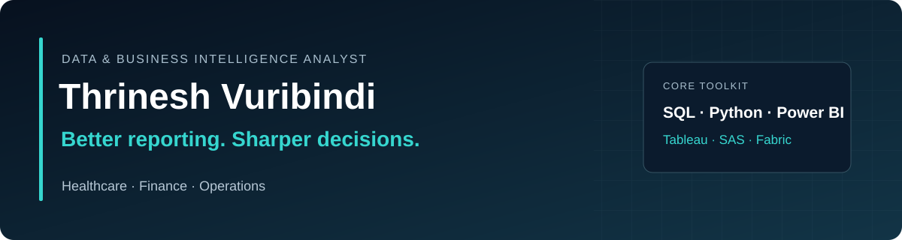

  

  
  
  

  Data Analyst and BI Developer with <b>4.5+ years</b> of experience in healthcare, finance, and operations analytics. 
  I build end-to-end BI solutions, from SQL and Python data preparation to star-schema semantic models, DAX measures, and Power BI dashboards.

---

## 💼 What I Do

- **BI development:** Power BI reports and semantic models, DAX measures, Power Query, drill-through and what-if analysis
- **Data modeling and preparation:** star schemas, SQL transformations, medallion lakehouse pipelines in Microsoft Fabric
- **Analytics:** KPI design, data validation and reconciliation, statistical testing, trend analysis

## 📊 Featured Projects

| Project | What I built and found | Tools | Code |
| :--- | :--- | :--- | :---: |
| **Surgical Scheduling Variance Analysis** Healthcare operations | Built a Fabric medallion pipeline and Power BI semantic model with **17 DAX measures** on **48,118 surgical cases**. Ranked the **133 procedures** that drive **53.6%** of scheduling variance | Microsoft Fabric, PySpark, Spark SQL, Power BI, DAX | [Repo](https://github.com/thrinesh13/Surgical-Scheduling-Variance-Analysis) |
| **Medicare Claims Payment Integrity Analytics** Healthcare payment integrity | Built staging, core, and mart layers in PostgreSQL and a **4-page star-schema Power BI report**. **10 SQL prepayment edits** caught **82%** of improper claims and cut modeled review cost from **$425K to $120K** | SQL, PostgreSQL, Python, Power BI, DAX, Power Query | [Repo](https://github.com/thrinesh13/Medicare-Claims-Payment-Integrity-Analytics) |
| **Statistical Time-Series Analysis** Financial markets | Tested **4 market assumptions** on **1,254 trading days** with t-tests, correlation, and normality tests. **3 were not supported** by the data | Python, pandas, SciPy, Matplotlib | [Repo](https://github.com/thrinesh13/Statistical-Time-series-analysis) |

## 🏅 Certification

## 🛠️ Tech Stack

| Area | Tools |
| :--- | :--- |
| **BI and visualization** |      |
| **Data platforms and modeling** |       |
| **Analytics and programming** |      |
